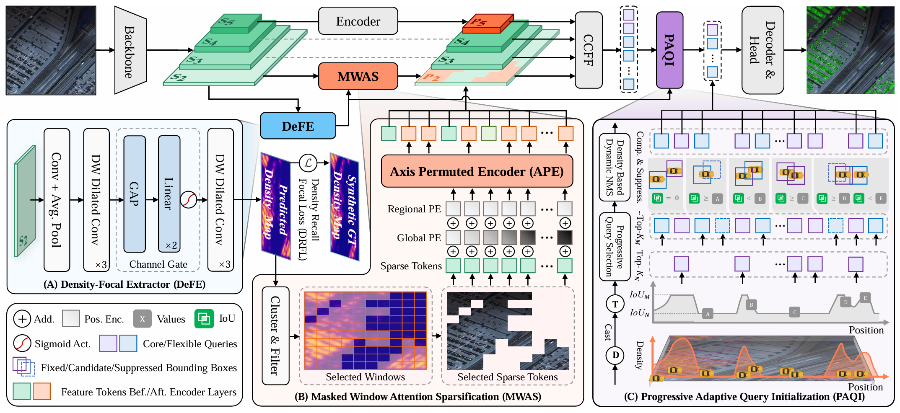

<h1 align="center">[ACMMM25] Dome-DETR: DETR with Density-Oriented Feature-Query Manipulation for Efficient Tiny Object Detection</h1>

<p align="center">
    <a href="https://github.com/RicePasteM/Dome-DETR/blob/master/LICENSE" style="text-decoration: none;">
        
    </a>
    <a href="https://github.com/RicePasteM/Dome-DETR/pulls" style="text-decoration: none;">
        
    </a>
    <a href="https://github.com/RicePasteM/Dome-DETR/issues" style="text-decoration: none;">
        
    </a>
    <a href="https://arxiv.org/abs/2505.05741" style="text-decoration: none;">
        
    </a>
</p>

<p align="center">
    📄 This is the official implementation of the paper:
    <br>
    <a href="https://arxiv.org/abs/2505.05741">Dome-DETR: DETR with Density-Oriented Feature-Query Manipulation for Efficient Tiny Object Detection</a>
</p>



## Updates

[2025/7/15] We made our code repo public.

[2025/7/7] Our paper has been accepted by ACM Multimedia 2025.

[2025/5/16] We released the pretrained checkpoints of Dome-DETR.

## Known Issues

- [ ] Due to dynamic query numbers, current code only supports single-batch training on each GPU, which will be fixed later.

## Pretrained Checkpoints

| Model           | Dataset      | AP   | #Params | GFLOPs | config                                    | device                                    | checkpoint                                                                                               | logs                                                                                                    |
|:-:|:-:|:-:|:-:|:-:|:-:|:-:|:-:|:-:|
| **Dome-DETR-M** | AI-TOD-V2    | 33.9 | 23.9M   | 252.6  | [yml](./configs/dome/Dome-M-AITOD.yml) | 8*RTX 4090   | [33.9](https://huggingface.co/RicePasteM/Dome-DETR/resolve/main/pretrain_ckpts/Dome-M-AITOD-best.pth)    | [url](https://huggingface.co/RicePasteM/Dome-DETR/resolve/main/pretrain_ckpts/Dome-M-AITOD-best.log)    |
| **Dome-DETR-L** | AI-TOD-V2    | 35.0 | 36.0M   | 358.7  | [yml](./configs/dome/Dome-L-AITOD.yml)  | 8*RTX 4090     | [35.0](https://huggingface.co/RicePasteM/Dome-DETR/resolve/main/pretrain_ckpts/Dome-L-AITOD-best.pth)    | [url](https://huggingface.co/RicePasteM/Dome-DETR/resolve/main/pretrain_ckpts/Dome-L-AITOD-best.log)    |
| **Dome-DETR-M** | VisDrone2019 | 38.2 | 23.9M   | 284.5  | [yml](./configs/dome/Dome-M-VisDrone.yml) | 8*RTX 4090   | [38.2](https://huggingface.co/RicePasteM/Dome-DETR/resolve/main/pretrain_ckpts/Dome-M-VisDrone-best.pth) | [url](https://huggingface.co/RicePasteM/Dome-DETR/resolve/main/pretrain_ckpts/Dome-M-VisDrone-best.log) |
| **Dome-DETR-L** | VisDrone2019 | 39.1 | 36.0M   | 376.4  | [yml](./configs/dome/Dome-L-VisDrone.yml) | 8*RTX 4090   | [39.1](https://huggingface.co/RicePasteM/Dome-DETR/resolve/main/pretrain_ckpts/Dome-L-VisDrone-best.pth) | [url](https://huggingface.co/RicePasteM/Dome-DETR/resolve/main/pretrain_ckpts/Dome-L-VisDrone-best.log) |

## Setup

```shell
conda create -n dome python=3.11.9
conda activate dome
pip install -r requirements.txt
```

## Eval

```sh
# Change the parameters in dist_test.sh according to your need.
bash dist_test.sh
```

## Prepare Datasets

<details close>
<summary> AI-TOD-v2 </summary>

- Step 1: Download the AI-TOD image set from `https://github.com/jwwangchn/AI-TOD`, along with the AI-TOD-v2 annoations from `https://github.com/Chasel-Tsui/mmdet-aitod`.
Or you can download the collected full dataset provided by `https://github.com/hoiliu-0801/DQ-DETR`.

- Step 2: Change the paths in `configs\dataset\aitod_detection.yml`.


</details>


<details close>
<summary> VisDrone2019 </summary>

- Step 1: Download the VisDrone2019 dataset from `https://github.com/VisDrone/VisDrone-Dataset`.

- Step 2: Process the dataset using our provided tools in `tools\dataset\visdrone2coco.py`, which convert the dataset into COCO format and filters out reduntant categories.

</details>

## Train

```sh
# Change the parameters in dist_train.sh according to your need.
bash dist_train.sh
```

## Citation

If you use Dome-DETR or its methods in your work, please cite the following BibTeX entries:

<details open>
<summary> bibtex </summary>

```bibtex
@misc{2505.05741,
  Author = {Zhangchi Hu and Peixi Wu and Jie Chen and Huyue Zhu and Yijun Wang and Yansong Peng and Hebei Li and Xiaoyan Sun},
  Title = {Dome-DETR: DETR with Density-Oriented Feature-Query Manipulation for Efficient Tiny Object Detection},
  Year = {2025},
  Eprint = {arXiv:2505.05741},
}

@misc{peng2024dfine,
      title={D-FINE: Redefine Regression Task in DETRs as Fine-grained Distribution Refinement},
      author={Yansong Peng and Hebei Li and Peixi Wu and Yueyi Zhang and Xiaoyan Sun and Feng Wu},
      year={2024},
      eprint={2410.13842},
      archivePrefix={arXiv},
      primaryClass={cs.CV}
}
```

</details>

## Aknowledgement

Dome-DETR is built upon [D-FINE](https://github.com/Peterande/D-FINE). Also, thanks to the inspirations from [DQ-DETR](https://github.com/hoiliu-0801/DQ-DETR).

✨ Feel free to contribute and reach out if you have any questions! ✨
